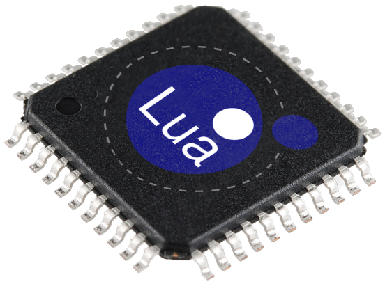

.. Lua EOS documentation master file, created by
   sphinx-quickstart on Tue Apr 20 15:34:00 2021.
   You can adapt this file completely to your liking, but it should at least
   contain the root `toctree` directive.

Lua EOS
=======

Introduction
------------

| Lua EOS is an embedded multi-task framework where the application layer can be written in Lua Scripts. It provides event driven non-preemptive Lua tasks. It is the same successful idea been used in many systems where Java VM provides a secure way for end users to write applications without compromising the native implementation. Lua is very light weight and suitable for embedded systems.
| 
| The solution that Lua EOS provides: product suppliers can securely provide programming capabilities to their end users without disclosing any native code (libraries). End user scripts run "out-of-the-box" from the file system. For example, supposed a company sells a weather station; The end user could write small scripts to take actions like turn fan on when temperature is above a value, send an email when a sensor is triggered, etc.

.. toctree::
   :maxdepth: 2
   :caption: Contents:

Indices and tables
==================

* :ref:`genindex`
* :ref:`modindex`
* :ref:`search`
